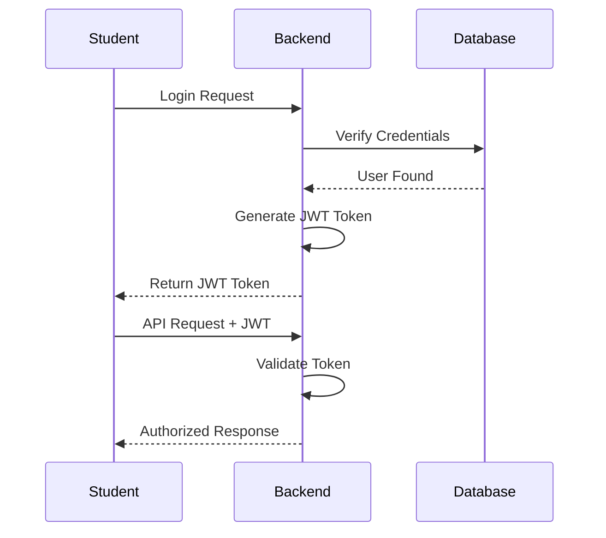
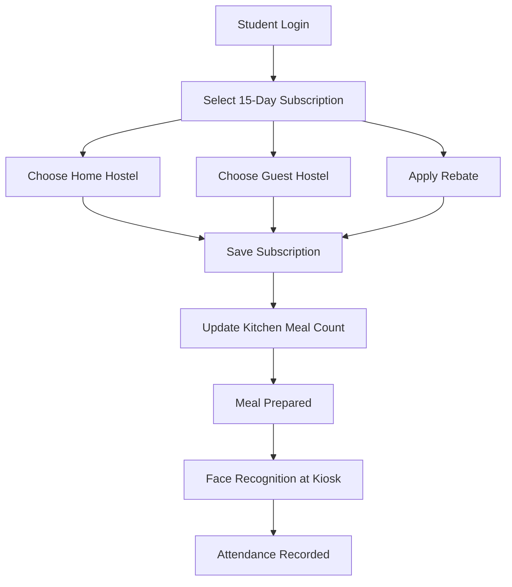

# 🏠 OmniMess – The Smart Hostel Network

<div align="center">

### *"Making every meal count. Reducing food waste. Empowering students through technology."*


**An AI-powered Hostel Mess Management System that minimizes food wastage, streamlines meal planning, enables hostel flexibility, and digitizes attendance through Facial Recognition.**

---

> **"The money follows the student."**

Instead of allocating food budgets to hostels irrespective of actual attendance, OmniMess ensures that meal expenditure follows the student's real dining choice.

</div>

---

# 📖 Table of Contents

* Project Vision
* The Problem
* Why Existing Systems Fail
* Our Initial Solution
* Why We Pivoted to a 15-Day Subscription
* Our Final Solution
* Social Impact
* Key Features
* System Architecture
* Backend First Development
* Technology Stack
* Folder Structure
* Database Design
* API Documentation
* API Flow
* Facial Recognition Pipeline
* Installation
* Environment Variables
* Future Scope
* Contributors
* License

---

# 🌍 Project Vision

Every day, thousands of hostel meals are prepared without knowing how many students will actually arrive.

Some students eat outside.

Some go home.

Some visit friends' hostels.

Some simply skip meals.

The kitchen still prepares food.

The result?

* Massive food wastage
* Financial losses
* Poor inventory planning
* Manual attendance
* Rebate misuse
* Unnecessary paperwork

**OmniMess** was created to solve these problems through intelligent planning, automation, and AI.

Rather than building another mess management software, we wanted to build a **Smart Hostel Network** where students, wardens, managers, and kitchens all operate from the same real-time data.

---

# 🚨 The Problem Statement

Universities with multiple hostels often face several recurring operational challenges.

## Food Wastage

Mess staff estimate meal counts instead of preparing meals based on actual demand.

Hundreds of meals may be cooked unnecessarily.

---

## Rebate Misuse

Traditional rebate systems depend heavily on paperwork.

Students often forget to apply.

Managers spend hours verifying requests.

---

## No Hostel Flexibility

A student living in Hostel A cannot conveniently have meals in Hostel B.

Current systems are rigid.

---

## Manual Attendance

Attendance is often maintained through:

* Paper registers
* QR codes
* Manual verification

These methods are slow and susceptible to misuse.

---

## Financial Inefficiency

Hostels receive budgets regardless of actual meal consumption.

There is no transparent mechanism to track where students actually eat.

---

# 💡 Our Initial Idea — Daily Meal Booking

Initially, OmniMess was designed around **daily meal selection**.

Students would choose:

* Eat in Home Hostel
* Eat in Guest Hostel
* Apply Rebate

for every single day.

Although this provided flexibility, we soon identified several operational challenges.

## Problems with Daily Booking

* Students frequently forgot to book meals.
* Kitchen staff struggled with constantly changing meal counts.
* Managers had to process updates every day.
* Demand forecasting became highly volatile.
* User engagement dropped due to repetitive daily actions.

The system solved one problem but unintentionally created another: **high operational overhead**.

---

# 🔄 Why We Shifted to a 15-Day Subscription

After evaluating the workflow from both the student's and the administration's perspective, we redesigned the system.

Instead of asking students to make decisions every day, we introduced a **15-day meal subscription cycle**.

Students now plan their meals in advance.

For the next 15 days they can choose:

* Home Hostel
* Guest Hostel
* Rebate days

This change significantly improved the overall system.

## Benefits

### Better Kitchen Planning

Kitchen staff now know meal demand well in advance.

---

### Reduced Food Wastage

Food preparation aligns closely with actual attendance.

---

### Better Inventory Management

Vegetables, grains, dairy, and other supplies can be purchased more accurately.

---

### Less Administrative Work

Managers no longer need to process hundreds of requests every day.

---

### Better User Experience

Students interact with the system once every 15 days instead of daily.

---

### More Predictable Operations

Long-term planning enables smoother hostel operations.

---

# 🌱 Our Contribution to Society

Food wastage is not merely a logistical issue—it is an environmental and social concern.

Every meal wasted represents:

* Wasted water
* Wasted electricity
* Wasted fuel
* Wasted manpower
* Wasted money

By enabling accurate meal forecasting, OmniMess contributes toward:

* Sustainable campus operations
* Reduced carbon footprint
* Responsible resource utilization
* Efficient budgeting
* Digital governance

Even a reduction of **5–10%** in unnecessary meal preparation across multiple hostels can save thousands of meals annually.

Technology should not only solve technical problems—it should create meaningful social impact.

---

# 💰 The "Money Follows the Student" Model

Traditional systems allocate mess budgets hostel-wise.

OmniMess changes this philosophy.

Instead, the **meal budget follows the student**.

If a student chooses to dine in another hostel, the financial allocation moves accordingly.

This creates:

* Fair budgeting
* Transparent accounting
* Better utilization of hostel resources

---

# ⭐ Key Features

* Secure Authentication
* JWT Authorization
* Student Registration
* Hostel Allocation
* 15-Day Meal Subscription
* Smart Rebate System
* Guest Hostel Selection
* Attendance Tracking
* Facial Recognition Verification
* Manager Dashboard
* Transaction Tracking
* Real-Time APIs
* MongoDB Database

---

# 🏗 System Architecture

```text
                 Student Mobile App
                         │
                         ▼
                 Flutter Frontend
                         │
                         ▼
                 Express REST APIs
                         │
        ┌────────────────┼────────────────┐
        ▼                ▼                ▼
 Authentication     Subscription      Attendance
        │                │                │
        ▼                ▼                ▼
    JWT Service      Rebate Logic   Face Verification
        │
        ▼
      MongoDB Atlas
```

---

# ⚙ Backend-First Development Approach

This project was intentionally developed using a **Backend-First** methodology.

Instead of beginning with UI design, the system architecture and APIs were implemented first.

## Why?

A robust backend defines the application's core business logic.

By developing the backend first, we ensured:

* Well-designed database models
* Stable REST APIs
* Secure authentication
* Modular architecture
* Easy frontend integration
* Independent testing

The backend was thoroughly tested before connecting Flutter and the AI kiosk.

This approach reduced integration issues and allowed multiple components to be developed in parallel.

---

# 🧰 Technology Stack

## Backend

* Node.js
* Express.js

## Database

* MongoDB Atlas
* Mongoose ODM

## Authentication

* JWT
* bcrypt

## Mobile

* Flutter

## AI Module

* Python
* OpenCV
* InsightFace / ArcFace
* YOLO (for person detection)

## API

* REST APIs

## Development Tools

* VS Code
* Git
* GitHub
* Postman
* MongoDB Atlas

---

# 📂 Project Structure

```text
OmniMess/
│
├── backend/
│   ├── src/
│   │   ├── controllers/
│   │   ├── middleware/
│   │   ├── models/
│   │   ├── routes/
│   │   ├── utils/
│   │   ├── app.js
│   │   └── server.js
│
├── kiosk/
│   ├── kiosk.py
│   ├── face_engine.py
│   ├── api_client.py
│   └── voice.py
│
├── mobile_app/
│
├── README.md
└── .gitignore
```

---

# 🗄 Database Models

* User
* Hostel
* Subscription
* Attendance
* Rebate
* Transaction

Each model represents an independent domain and follows a modular architecture.

---

# 🔐 Authentication Flow



---

# 🍽 Meal Subscription Flow


---

# 🤖 Facial Recognition Flow

```mermaid
flowchart TD

Camera

-->YOLO

YOLO

-->Face Detection

Face Detection

-->Face Embedding

Face Embedding

-->Backend API

Backend API

-->Subscription Check

Subscription Check

-->Attendance

Attendance

-->Access Granted
```

---

# 📡 REST API Flow

```mermaid
flowchart LR

Client

-->Authentication API

Authentication API

-->JWT

JWT

-->Protected APIs

Protected APIs

-->Controllers

Controllers

-->Services

Services

-->MongoDB
```

---

# 📘 API Overview

## Authentication

```
POST /api/auth/register

POST /api/auth/login
```

---

## Subscription

```
POST /api/subscription

GET /api/subscription

PUT /api/subscription
```

---

## Rebate

```
POST /api/rebate

GET /api/rebate
```

---

## Attendance

```
POST /api/attendance

GET /api/attendance
```

---

## Hostel

```
GET /api/hostels
```

---

# 🚀 Installation

Clone the repository

```bash
git clone <repository-url>
```

Install backend dependencies

```bash
cd backend

npm install
```

Create `.env`

```env
PORT=5000
MONGODB_URI=your_mongodb_uri
JWT_SECRET=your_secret
```

Run backend

```bash
npm run dev
```

Run Flutter

```bash
flutter pub get

flutter run
```

---

# 🔮 Future Scope

* AI-based meal demand prediction
* Real-time analytics dashboard
* QR fallback verification
* Push notifications
* Payment gateway integration
* Nutrition analytics
* Multi-campus deployment
* Cloud-native microservices
* AI fraud detection
* Admin analytics with BI dashboards

---

# ❤️ Why OmniMess Matters

OmniMess is more than a hostel management system.

It demonstrates how software engineering, artificial intelligence, and thoughtful system design can solve a real operational problem with tangible social benefits.

By reducing food waste, simplifying administration, improving transparency, and optimizing resource allocation, the platform contributes to a smarter and more sustainable campus ecosystem.

Every correctly planned meal represents fewer wasted resources, lower operational costs, and a more responsible use of public infrastructure.

---

# 👩‍💻 Contributors

Developed as part of a Full Stack Development Project under **AIMS Lab, IIIT Allahabad**.

We welcome suggestions, improvements, and contributions that help make campus dining more efficient and sustainable.

---

# 📜 License

This project is released under the **MIT License**.

See the `LICENSE` file for details.

---

<div align="center">

### ⭐ If you found this project interesting, consider giving it a star!

**Building technology that serves people, reduces waste, and creates a smarter future.**

</div>
